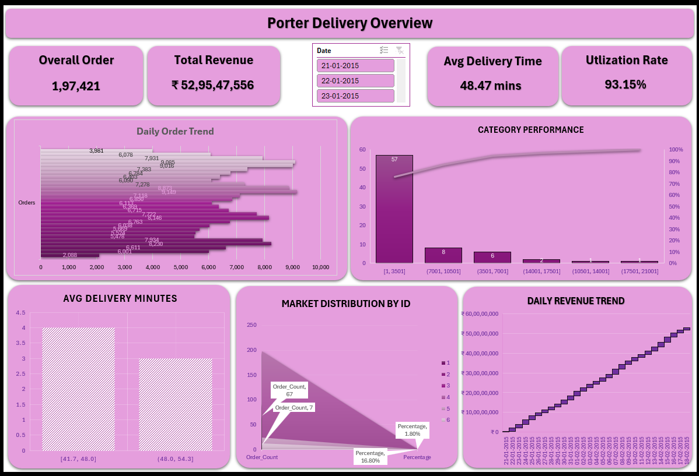

# Porter-Excel-Analysis

   

---

## Overview

This project investigates the drop in customer satisfaction experienced by Porter Delivery across its key markets. By analyzing delivery performance data, the goal is to identify the underlying reasons behind late deliveries and offer actionable, data-backed solutions to enhance on-time service and overall customer experience—ultimately supporting the company’s efforts to restore its market competitiveness.

---

## Dataset

The analysis leverages Porter Delivery’s operational data, structured across three interconnected tables within a single Excel workbook. The primary dataset resides in the **Orders** sheet, which captures comprehensive details for each delivery—including logistics information like `Ship Date` and `Ship Mode` (e.g., Same Day, First Class), customer and geographic data such as `Customer ID`, `City`, `State`, and `Region`, product attributes like `Category`, `Sub-Category`, and `Product Name`, and financial metrics including `Sales`, `Quantity`, `Discount`, and `Profit`. Complementing this is the **Returns** sheet, which logs returned orders using `Order ID` (linked to the Orders table) and a `Returned` flag (Yes/No), serving as a direct proxy for customer dissatisfaction. Lastly, the **People** sheet functions as a reference table, mapping regional managers (`Person`) to their respective `Region`. By merging these tables—particularly through shared keys like `Order ID` and `Region`—the analysis can uncover how delivery performance, customer segments, product types, and return patterns collectively contribute to the observed decline in customer satisfaction.

[Link for Dataset](https://www.kaggle.com/datasets/ranitsarkar01/porter-delivery-time-estimation)

---

## Analysis

To understand the reasons behind Porter Delivery’s falling customer satisfaction, I conducted a structured two-phase analysis of the order dataset.

- **Data Cleaning:** Handled missing entries in critical columns such as `actual_delivery_time`, `store_primary_category`, and partner-related fields like `total_onshift_partners`.  
- **Data Type Conversion:** Converted timestamp fields—`created_at` and `actual_delivery_time`—from text strings into proper **datetime format** to enable accurate time-based computations.  
- **Feature Creation:** Derived new analytical variables, including **delivery duration**, and extracted temporal features such as **hour of order placement** and **day of the week**.
- **Demand Pattern Identification:** Pinpointed **peak ordering hours** and **busiest days of the week** to evaluate pressure points in the delivery infrastructure.  
- **Service Performance Metrics:** Measured the **proportion of orders completed within 30 minutes** and examined the **distribution of delivery durations**, revealing notable outliers and delays.  
- **Root Cause Exploration:**  
  - Compared **average delivery times across store categories** and flagged the **five stores with the slowest performance**.  
  - Assessed the **relationship between order volume and the count of active (busy) delivery partners** to gauge staffing efficiency.  
  - Investigated how **delivery speed varies by day of the week** to uncover consistent weekly operational bottlenecks.

This process uncovered specific systemic weaknesses—such as underperforming stores, inefficient resource allocation during rush periods, and category-level delays—laying the groundwork for precise, data-driven operational enhancements.

---

## Dashboard

**⚠️ IMPORTANT: To use this dashboard, open the file `Porter.xlsx` and navigate to the “Dashboard” sheet. All interactive elements function only within this tab.**

- This dashboard provides a strategic overview of Porter Delivery’s operational performance across key metrics.
- Highlights include total orders (1,97,421), revenue (₹52.95 Cr), average delivery time (48.47 mins), and partner utilization (93.15%).
- Visuals track daily order volume, category-wise performance, market distribution by ID, and revenue trends over time.
- Interactive date slicers let users drill into specific days (e.g., 21–23 Jan 2015) for granular analysis.
- Designed for operations and leadership teams to monitor efficiency, identify bottlenecks, and optimize resource allocation.
- Enables quick identification of high-performing vs. underperforming segments to drive targeted improvements.
- Supports data-informed decisions to reduce delivery delays and enhance customer satisfaction.

---

   

---

